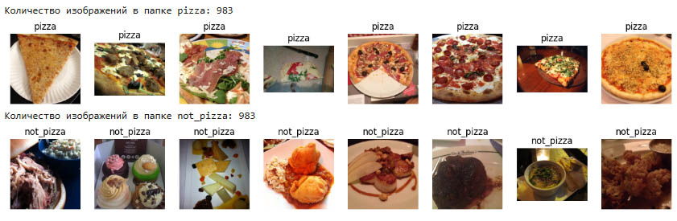
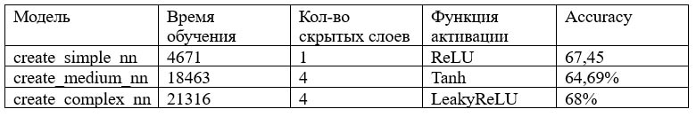

**Разработка полностью связанной нейронной сети**

**Цель:** получить базовые навыки работы с одной из библиотек глубокого
обучения (Caffe, Torch, TensorFlow или MXNet на выбор) на примере
полностью связанных нейронных сетей.

**Задачи:** Выполнение практической работы предполагает решение следующих задач:
1. выбор библиотеки для выполнения практических работ курса;
2. установка выбранной библиотеки на кластере;
3. проверка корректности установки библиотеки;
4. разработка и запуск тестового примера сети, соответствующей логистической регрессии, для решения задачи классификации рукописных цифр набора данных MNIST;
5. выбор практической задачи компьютерного зрения для выполнения практических работ;
6. разработка программ/скриптов для подготовки тренировочных и тестовых данных в формате, который обрабатывается выбранной библиотекой;
7. разработка нескольких архитектур полностью связанных нейронных сетей (варьируются количество слоев и виды функций активации на каждом слое) в формате, который принимается выбранной библиотекой;
8. обучение разработанных глубоких моделей;
8. тестирование обученных глубоких моделей;
9. сделать вывод относительно разработанных архитектур;
10. подготовка отчета, содержащего минимальный объем информации по каждому этапу выполнения работы.

Код [ссылка](lab2.ipynb)

Отчет [ссылка](Отчет_Лаб2.docx) 

В работе использован набор данных для классификации [ссылка] (https://www.kaggle.com/datasets/carlosrunner/pizza-not-pizza/data), в котором содержатся изображения есди, разбитые на 2 папки (pizza и not_pizza); в каждой папке 983 файла.

Были разработаны 3 нейросети, согласно заданию. Результаты работы представлены в табице ниже:

**Вывод:** 
**Сreate_simple_nn ()** оказалась наиболее успешной из предоставленных данных с максимальной точностью 69.5%. Её простота позволила избежать излишней сложности и проблем с настройкой гиперпараметров, но она ограничена в способности улавливать сложные закономерности, что выражается в плато на поздних эпохах.
**Сreate_medium_nn()** (предположительно) могла показать схожие или чуть лучшие результаты благодаря четырём слоям, но активация tanh, вероятно, замедлила обучение из-за исчезающего градиента.
**Сreate_complex_nn()** неожиданно показала худший результат (66.36%), несмотря на сложную архитектуру с Batch Normalization, Dropout и LeakyReLU. Это может быть связано с неоптимальной скоростью обучения (0.001), избыточным Dropout или общей неподходящей архитектурой для изображений. Однако она лучше контролировала переобучение. 
Основная проблема всех моделей: Полносвязные сети не подходят для классификации изображений, так как теряют пространственную информацию. Это ограничивает точность на уровне 66–69%, независимо от сложности архитектуры. Для сравнения, свёрточные нейронные сети (CNN) могли бы достичь точности 80–90% на аналогичных задачах, если данные содержат явные визуальные различия между классами.
